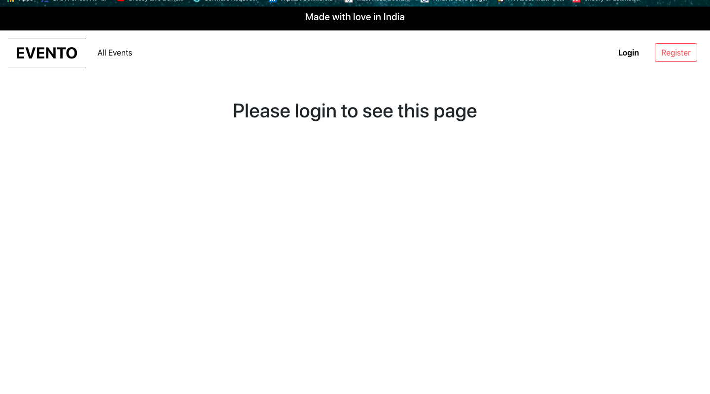

<h1>Evento- An Event App</h1>

  Evento is an event listing and viewing app with login and signup feature
  

<h3>Instruction to use</h3>
<ul>
<li>
  First of clone the project in any directoy of your choice
  </li>
  <li>
    Move into the directory and run <strong>npm install</strong>. After
    this run the same command in backend direcorty.
    </li>
    <li>
      Move to the backend directoy and spin the server by <strong>nodemon server.js</strong>

  </li>
      <li>
        In the root directory of the project run <strong>npm start</strong>
        </li>

   <li>
          Browser should open automatically. The app is ready to use
          </li>
   Make sure to replace the db username,password and db name in the connection string present in /backend/config/default.json. Else you will get Authentication error from MongoDB
  </ul>

  <h3>Tech Stack used</h3>
<ul>
  <li>
    React Js
    </li>
    <li>
      Node
      </li>
      <li>
        MongoDB
        </li>
        <li>
          Express
          </li>
  </ul>
  
  <h3>Project screenshot</h3>
  <h5>All Event Page</h5>
  
  
  <h5>Login</h5>
  
  
  
  <h5>Register</h5>
  
  
  
  <h5>Event Register</h5>
  
  
  <h5>Auth err</h5>
  
